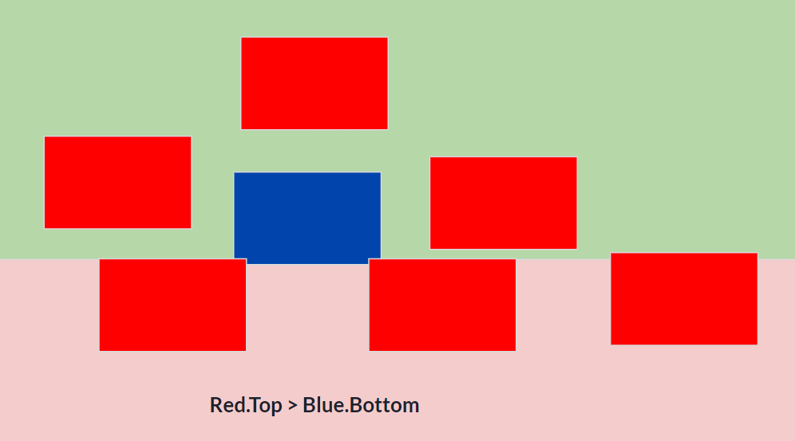
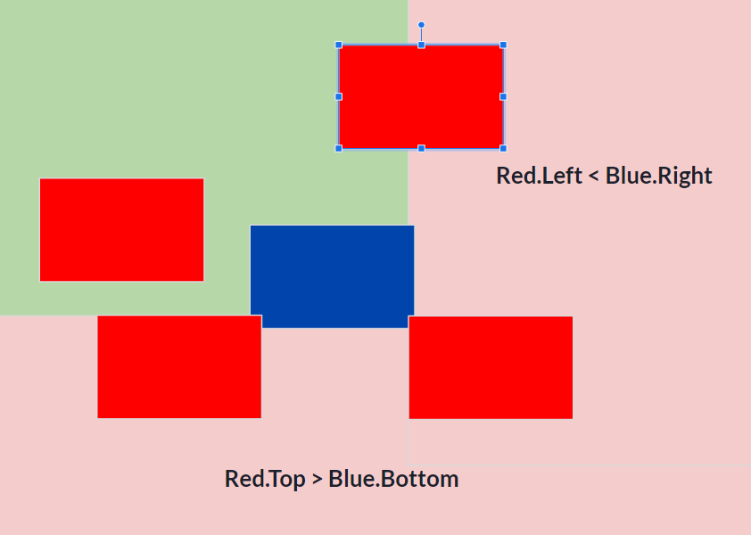
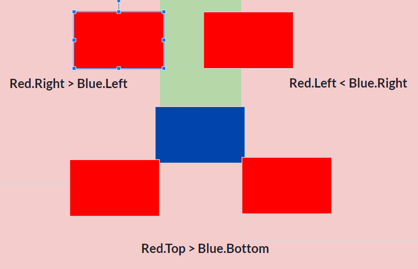

# Turtle Hit Box Tutorial

When programming a hit box, we are concerned with an objects bounding box, which includes the object's top, right, bottom, and left edges. A "hit" occurs when the bounding boxes of two objects overlap.

## No "Hit"

When there is no contact between the red player and the red box, it's because the bounding boxes of the two objects do not overlap.

## "Hit"
.png) &ensp; &ensp; &ensp;&ensp;&ensp;&ensp;&ensp;&ensp;&ensp;.png)
In the images above, the blue player has "hit" the red object, causing it to turn white. A collision is detected because the bounding boxes of the two objects overlap.

## Conditions of a Hit
Collision detection involves defining at least four conditions. Each condition restricts the area in which an object can be if it is to be in contact with the second object. Each condition reduces the available area by approximately half to check for collisions.

1. **First condition**: 
    Restricts the area where the object can be by reducing the overall area by half.
    In the example below, 

2. **Two Conditions**: Introduces a second restriction, further limiting the area where the object can be.

3. **Three Conditions**: Adds a third restriction, narrowing down the possible areas even more.

4. **Four Conditions**: The most comprehensive check, it restricts the object's area to a quarter of the original space, ensuring precise collision detection.

