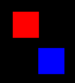

# Turtle Hit Box Tutorial

When programming a hit box, we focus on an object's bounding box, which encompasses the object's top, right, bottom, and left edges. A "hit" occurs when the bounding boxes of two objects overlap.

## No Collision/Contact/Hit

There is no contact, collision, or hit if the bounding boxes of two objects do not overlap. In the example above, the edges of the red box and the blue box do not overlap; therefore, there is no contact.

## Collision/Contact/Hit
.png) &ensp; &ensp; &ensp;&ensp;&ensp;&ensp;&ensp;&ensp;&ensp;.png)

A collision, contact, or hit occurs when the bounding boxes of the two objects overlap. In the images above, the blue box's top and left edges overlap with the white box's bottom and right edges, resulting in detected contact.

## Programming a Hit Box
When programming a hit box it is important to identify the direction in which an object is moving when it collides with another object.

### Conditions of a Hit
When programming a hit box, it's crucial to identify the direction in which an object is moving when it collides with another object. The direction of the object will determine the conditions needed to identify first contact. For example, if a red object is moving upwards and collides with a blue object, you'll need to adjust the collision detection conditions accordingly to detect the collision correctly.

In this scenario, if the red object is moving upwards:

- The first condition would typically check if the bottom edge of the red object is above the top edge of the blue object to determine if they are overlapping vertically (`red.bottom < blue.top`).
- The second condition would check if the left edge of the red object is to the left of the right edge of the blue object to determine if they are overlapping horizontally (`red.left < blue.right`).
- The third condition would ensure that the right edge of the red object is to the right of the left edge of the blue object to further confirm horizontal overlap (`red.right > blue.left`).
- The fourth condition would make sure that the top edge of the red object is below the bottom edge of the blue object to ensure vertical overlap (`red.top > blue.bottom`).

These conditions together determine if the two objects collide while considering the direction of the moving object. If all conditions are met, it indicates a collision between the red and blue objects. Adjustments would be necessary for detecting collisions if the red object is moving in a different direction.

1. **First Condition - Leading Edge Contact**:

    Identify when the leading edge of the first object contacts an edge of the second object. This condition ensures that the object's leading edge overlaps the nearest edge of the second object

2. **Second Condition - Corner-to-Corner Contact**:

    Restrict the position of the first object so that at least one corner of its bounding box contacts a corner of the second object's bounding box. This condition ensures a minimum level of contact necessary for a collision to occur.

3. **Third Condition - Corner-to-Corner Contact**:

    Further restrict the position of the first object so that it maximizes corner-to-corner contact with the second object. This condition ensures more robust collision detection by maximizing contact points between the objects.

4. **Fourth Condition - "In Front" Position**:

    Restrict the position of the first object to be "in front" of the second object, ensuring that it is positioned such that a collision is imminent. This condition helps prevent false positives by ensuring the objects are in a collision trajectory.

